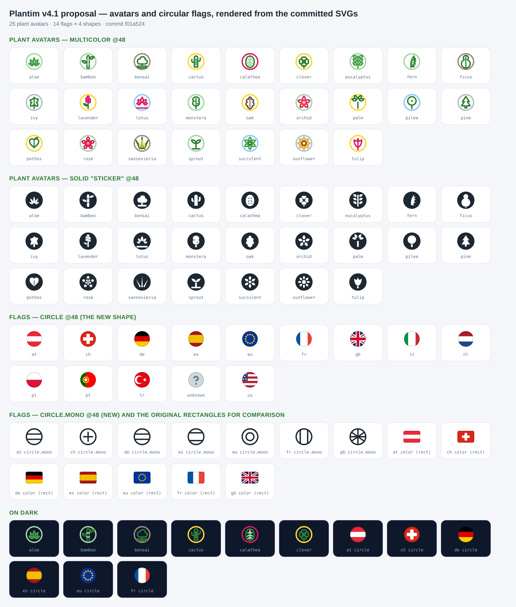

# Plantim Icons

Open-source semantic icon library for Vue, SwiftUI, and other Plantim-compatible
clients. One versioned registry produces the web and native adapters, keeping
icon meaning and geometry consistent across platforms.

## Packages

- `@plantim/icons` — Vue 3 package published to npm.
- `PlantimIcons` — Swift Package Manager package under `packages/PlantimIcons`.

The public API uses Plantim-owned names such as `navigation.back`,
`action.delete`, `plant.watering`, `utility.camera`, and `status.warning`.
Lucide names and raw SVG geometry are implementation details.

## Development

```sh
npm ci
npm run icons:validate
npm run icons:publish:dry-run
```

The canonical source is [`design-tokens/icons/registry.json`](design-tokens/icons/registry.json).
Run `npm run icons:generate` after registry changes. Generated adapters must be
committed and must have matching version and registry hash metadata.

## Icons 4.1

The v4 set is 289 icons: the original 237 plus loading-state placeholders, 25
plant profile avatars, and the specific cases the clients previously faked with
a neighbouring glyph. Flags ship separately as
[`design-tokens/icons/flags`](design-tokens/icons/flags/README.md) — an asset
class with fixed colours in rectangular and circular shapes, published as
`@plantim/icons/flags`.



The review that produced these additions is recorded in
[`reports/plantim-icons-v4.1-proposal-report.pdf`](reports/plantim-icons-v4.1-proposal-report.pdf)
and its catalog; those artifacts are historical and no longer regenerate, since
the proposal is now the shipped set.

## Compatibility

| Consumer or tool | Supported baseline |
| --- | --- |
| Vue consumer | Vue 3.0 or newer |
| npm package runtime | Modern ESM-capable browser or Node runtime |
| Repository tooling | Node 22.18+ and npm 11.12+ |
| Swift package | iOS 18+ and macOS 12+ |

The Lucide dependency is a pinned generator-only input. Applications consume
Plantim semantic names and never import Lucide directly.

## Contributions and licensing

See [CONTRIBUTING.md](CONTRIBUTING.md), [governance](design-tokens/icons/governance.md),
and [SECURITY.md](SECURITY.md). The project is released under the MIT License;
Lucide-derived geometry remains attributed in [NOTICE](NOTICE).
